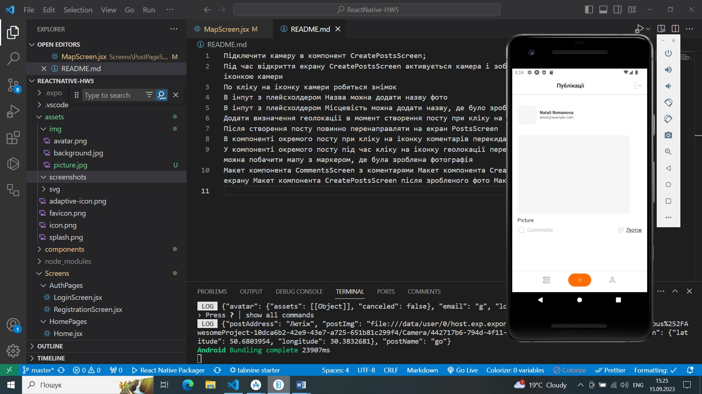
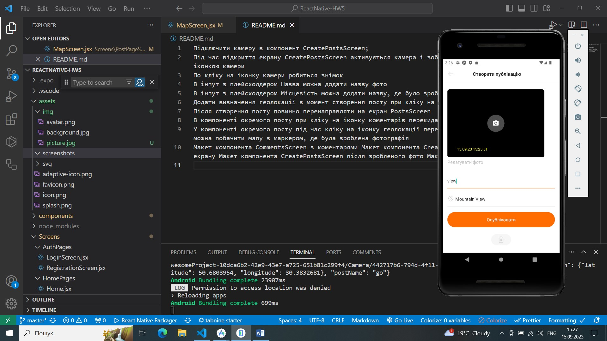
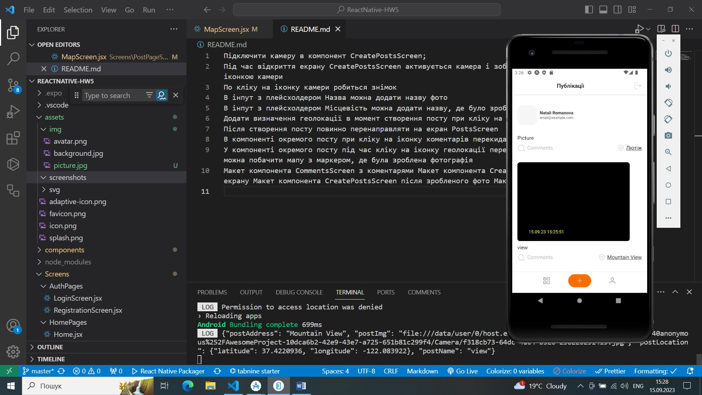
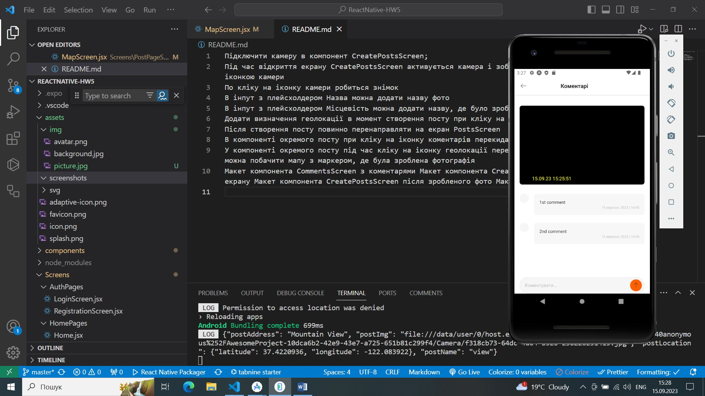
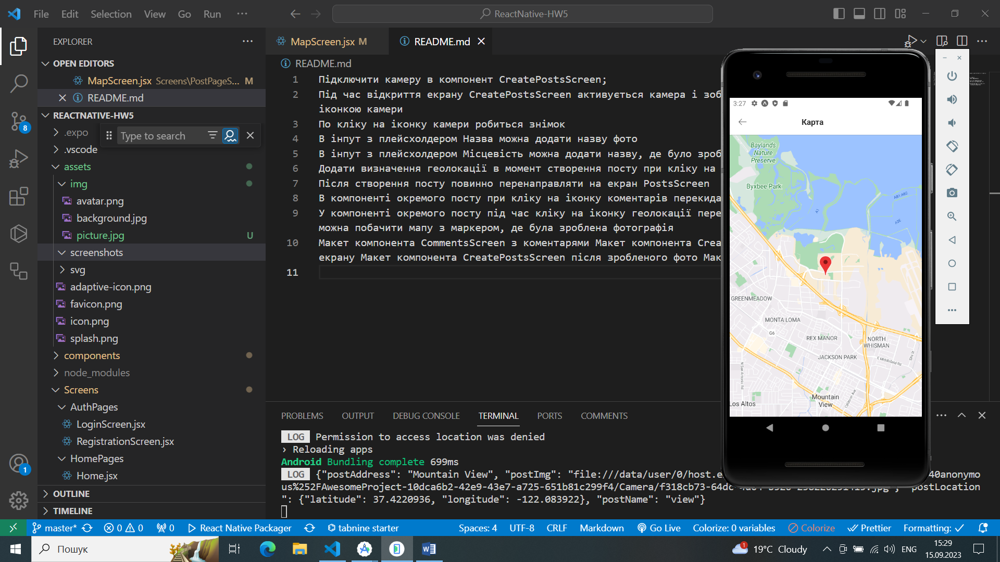
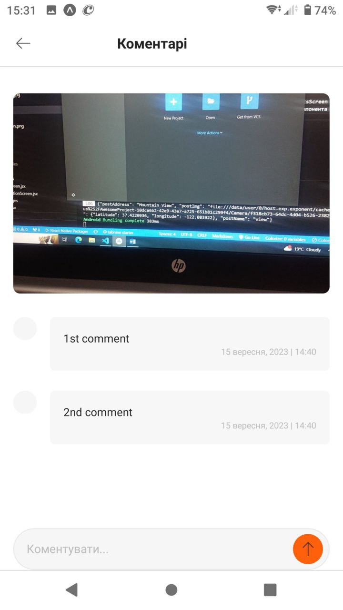
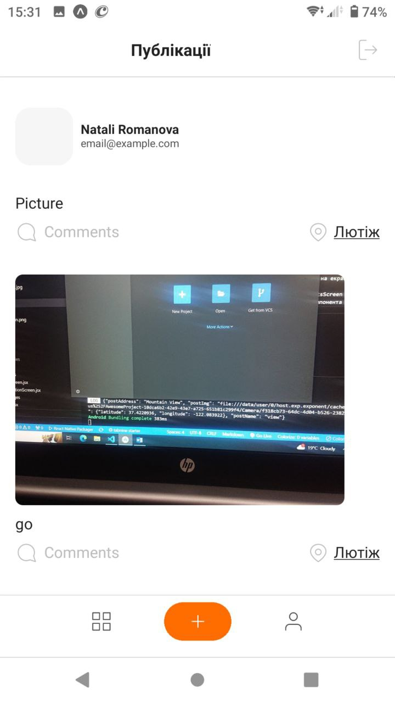
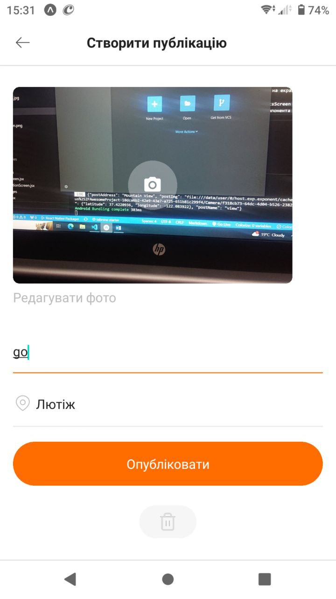
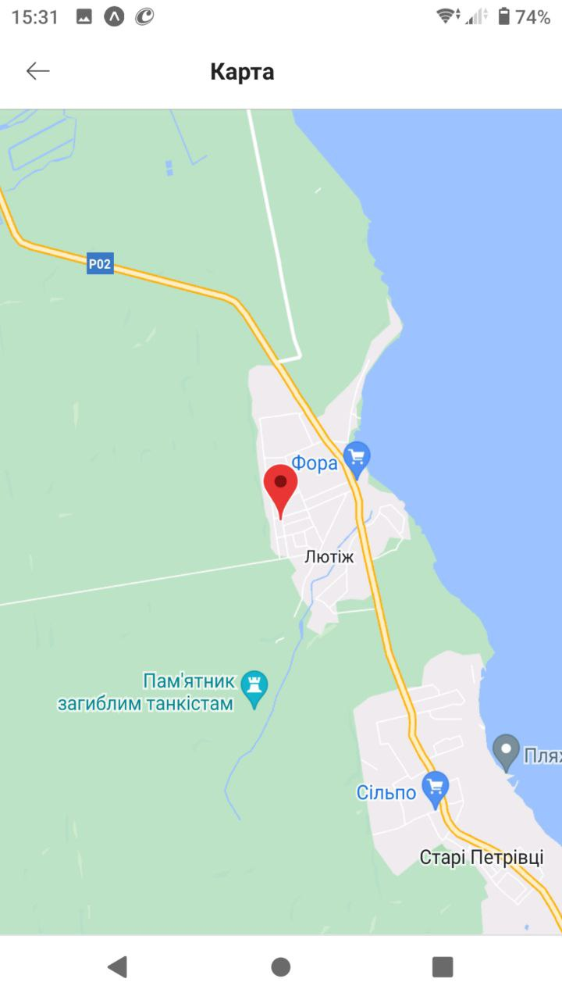

Підключити камеру в компонент CreatePostsScreen;
Під час відкриття екрану CreatePostsScreen активується камера і зображення з неї виводиться в блок з іконкою камери
По кліку на іконку камери робиться знімок
В інпут з плейсхолдером Назва можна додати назву фото
В інпут з плейсхолдером Місцевість можна додати назву, де було зроблено знімок
Додати визначення геолокації в момент створення посту при кліку на кнопку Опублікувати
Після створення посту повинно перенаправляти на екран PostsScreen
В компоненті окремого посту при кліку на іконку коментарів перекидає на екран CommentsScreen
У компоненті окремого посту під час кліку на іконку геолокації перекидає на екран MapScreen, де можна побачити мапу з маркером, де була зроблена фотографія
Макет компонента CommentsScreen з коментарями Макет компонента CreatePostsScreen під час відкриття екрану Макет компонента CreatePostsScreen після зробленого фото Макет компонента MapScreen

