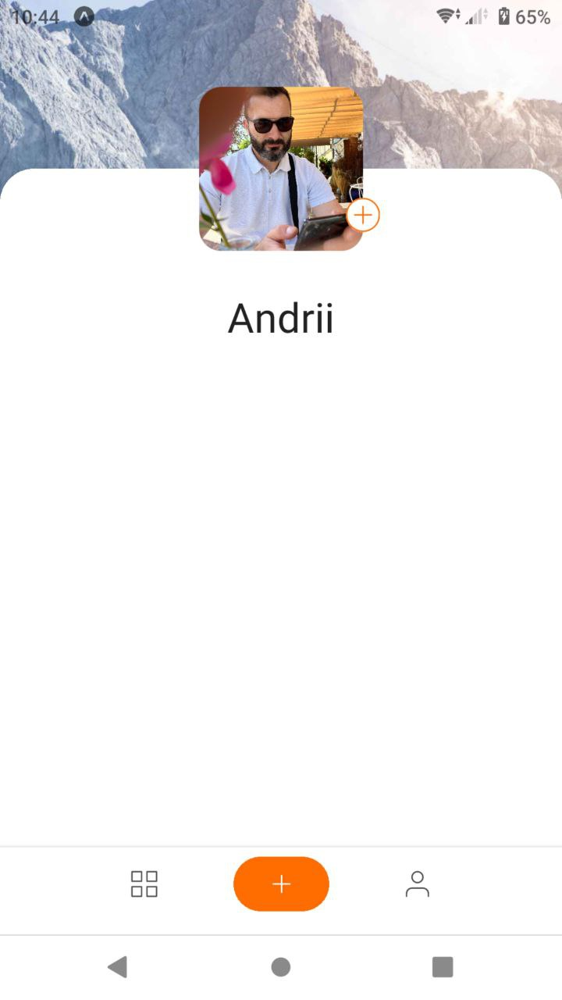
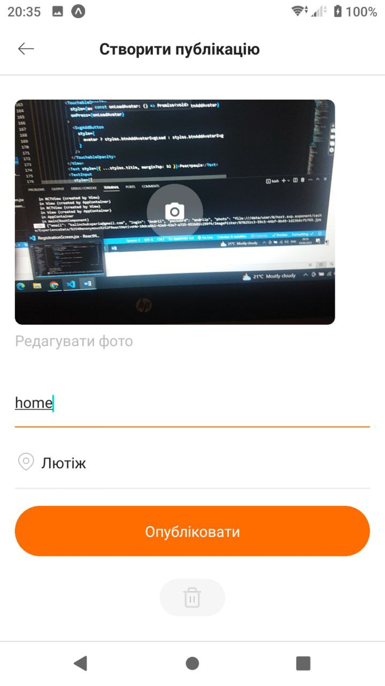
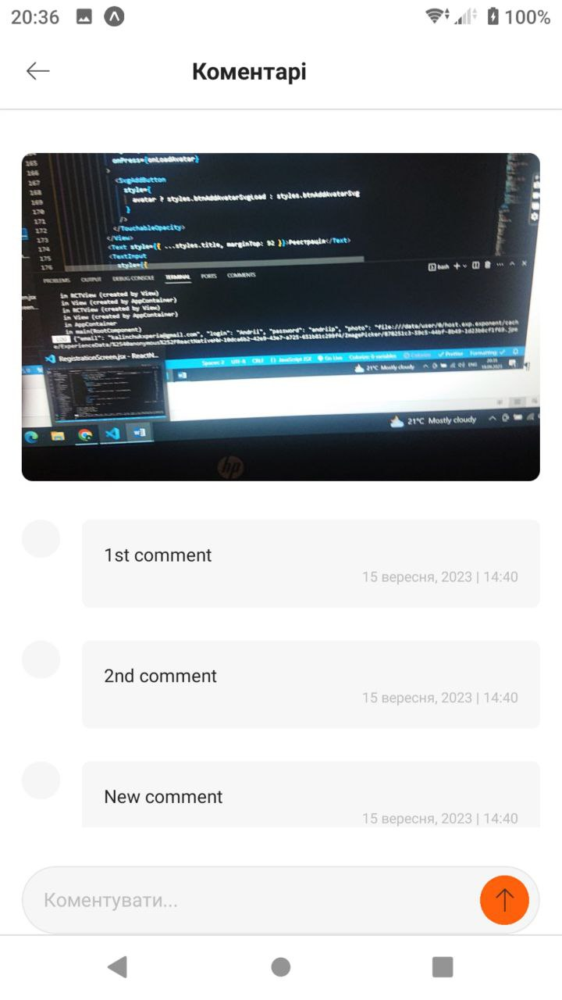

Підключити Redux до проекту
Підключити Firebase до проекту
Додати логіку реєстрації на екрані RegistrationScreen через методи Firebase
Додати логіку логіна на екрані LoginScreen через методи Firebase
Оновити профіль користувача на Firebase та додати туди логін у поле displayName після реєстрації
Зберігати дані про користувача в Redux після реєстрації або логінізації
Додати перевірку, чи залогінений користувач у застосунку чи ні. Якщо залогінений, то відразу перенаправляти на екран PostsScreen, інакше - на екран LoginScreen
Додати логіку Logout на екрані PostsScreen під час натискання на іконку в хедері, використовуючи методи Firebase
Додати логіку завантаження постів у базу даних, використовуючи Firebase та Redux
Додати логіку додавання коментаря під постом, використовуючи Firebase та Redux

